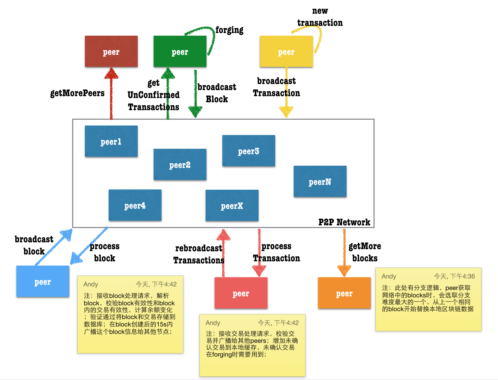
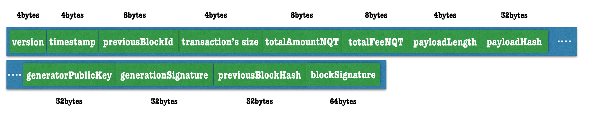
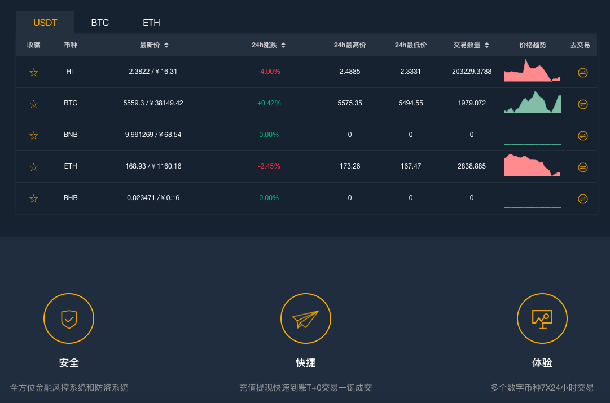
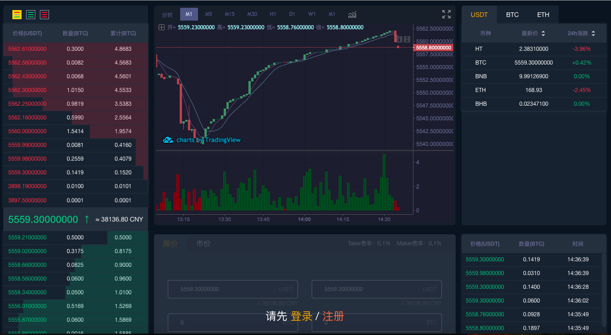

# HebeBlock
**聚焦区块链长尾市场──构建多维 Token 经济生态群落**

HebeBlock hebeblock@gmail.com

_注意: 如果您可以在GitHub上阅读此内容，那么我们仍在积极开发此文档。请定期检查更新！_

## 注意

本白皮书以及与本白皮书相关的任何其他文件涉及HebeBlock网络的预期开发和使用。它们仅供参考，可能会有所变化。

### 本白皮书描述了一个正在开发的项目

本白皮书包含基于HebeBlock信念的前瞻性陈述，以及HebeBlock提供的某些假设和信息。

本白皮书中设想的HebeBlock网络正在开发中，并且正在不断更新，包括但不限于关键治理和技术特性。HebeBlock令牌涉及并涉及实验平台（软件）和技术的开发和使用，这些平台可能无法实现或达到本白皮书中规定的目标。

如果HebeBlock网络完成，它可能与本白皮书中规定的网络有很大不同。对于任何计划，未来预测或前景的成就或合理性，我们不作任何陈述或保证，本文件中的任何内容均未被或不应作为对未来的承诺或陈述。

### 不提供受管制产品

Hebe代币并非旨在代表任何司法管辖区的证券或任何其他受监管产品。

本文件不构成对证券或任何其他受管制产品的要约或招揽，也不构成投资目的的促销，邀请或招揽。购买条款并非旨在提供金融服务的文件或任何形式的招股说明书。

Hebe代币不代表平台或软件或HebeBlock或与平台或任何其他公共或私人相关的任何其他公司或知识产权的股权，股份，单位，特许权使用费或资本，利润，回报或收入的权利。任何司法管辖区内的企业，公司，基金会或其他实体。

### 本白皮书不是建议

本白皮书不构成购买任何HEBE代币的建议。不得依赖任何合同或购买决定。

### 风险警告

购买HEBE代币和参与HEBE网络会带来很大的风险。

在购买HEBE代币之前，您应该仔细评估并考虑风险，包括https://hebeblock.com/ 和任何其他文档中列出的风险。

### 仅限HebeBlock的观点

本白皮书中表达的观点和意见是HebeBlock的观点和意见，并不一定反映任何政府，准政府，当局或公共机构（包括但不限于任何司法管辖区的任何监管机构）的官方政策或立场。任何管辖区。

本白皮书中包含的信息基于HebeBlock认为可靠的来源，但无法保证其准确性或完整性。

### 中文是本白皮书的授权语言

本白皮书及相关材料仅以英文发行。任何翻译仅供参考，未经HebeBlock或任何其他人认证。不保证任何翻译的准确性和完整性。如果本白皮书的翻译版和中文版之间存在任何不一致之处，则以中文版为准。

### 没有第三方认可从属关系

本白皮书中对特定公司和平台的引用仅用于说明目的。使用任何公司和/或平台名称和商标并不意味着与任何一方有任何关联或认可。

### 您必须获得所有必要的专业建议

在确定是否购买HEBE代币或以其他方式参与HEBE网络之前，您必须咨询律师，会计师和/或税务专业人士以及任何其他专业顾问。

## HEBE概述 ################################################################

> HEBE网络以希腊女神中青春女神赫柏（希腊语:Ἥβη；英语：Hebe）命名

HEBE的总币数是10亿个；

所有的货币都是在创世块中直接产生的，而产生创世块的账号是，HEBE-MRCC-2YLS-8M54-3CMAJ，这个账号的余额也被设置成负10亿个。在创世账号中的负货币值也带来几个有趣的影响：

创世账号无法发起任何交易，也无法支付交易费，因为账号余额是负数，因此这个账号的password也是对外公开的(注意，最后一个.也是密码一部分）：It was a bright cold day in April, and the clocks were striking thirteen.

任何送到这个账号上的HEBE货币都会被消灭，因为这个账号的负余额会使得转入货币和余额之间相互抵消；

转移给这个账号的HEBE资产也会被销毁；

### HEBE和NXT的关系

HEBE网络使用NXT区块链为基础，目前采用 NXT 1.11.5 GPL版本

为什么不采用JPL协议，由HEBE社区早期参与者投票决定，可在https://bbs.hebeblock.com/topic/93 查看记录

HEBE在NXT上贡献有walletnxt https://walletnxt.com 这是唯一一款NXT去中心化钱包，支持NXT所有克隆项目，目前用户量1100+

### 100% POS(Proof Of Stake) 股权证明

在HEBE的POS模型里，安全性是由持币者保证的。由POS带来的好处不会产生在POW中的集权化趋势

HEBE构建的系统，将每一枚钱币(coin)都看做是一台微小的挖矿机。账户中拥有的coin币数量越多，那么它有越大的几率获得生成一个block的机会。创建block的收益就是在block内部的交易费用。创建block不会产生新的coin。HEBE的重新分配发生在创建block的交易费中。

透明锻造(term forging)替代了挖矿（mining）。

随后的block生成基于前一个block的可证实的，独立的，不可预测的信息。创建一系列的blocks，这些block都可以回溯到创世块。block生成时间被设定为60s。但是可能结果的多样性导致了block的平均产生时间为80s，偶尔也会发生非常长时间的间隔。

安全性一直是POS系统关心的问题，下面是POS算法的基本概念：

* 累计的难度值被作为一个参数存储在每一个block中，下一个block的难度值会从前一个block中衍生出来；为了防止不一致的情况发生，网络会选取整个block chain的最大的累计难度值。

* 为了防止一个人在不同的账号间转移股权以达到增加获取block创造机会的行为发生，新转入的币(tokens)必须停留至少1440个块的时间才允许参与block生成系统。达到这一标准的货币才能为账号的有效股权，这个值会决定获得锻造的几率；

* 为了防止攻击者总是从创世模块生成新的block chain，网络仅允许chain重组从当前高度的前720块开始。任何提交的block高度低于这个值的都会被拒绝；

* 由于被单一账号控制blockchain的几率及其低，一旦交易被一个block确认后又生成了至少10个block，此时交易被认为是安全确认的

### 网络节点

网络节点是指在网络上贡献交易和区块数据的任何设备；任何运行HEBE服务的设备都可以看做是一个节点；

网络节点可以分为两种，带hallmark签名的和普通节点；hallmark节点是指带有一个加密签名的节点，这个加密签名是使用一个账号的私钥生成的。这个签名可以被解码分析出绑定到这个节点的账号的id和余额等信息；带有hallmark签名的节点可以看做是账号绑定的，因此这种节点会更安全；绑定到节点的余额越多，可信度就越高；可能一个攻击者想通过绑定账号的hallmark节点获取信任实施攻击，但是获取信任的代价阻止了这种行为的发生；

HEBE网络中的任何节点都有处理和广播交易、区块数据的能力。从其他节点接收的区块信息会被校验有效性；为了防止无效数据的传播，生成无效数据的节点会被临时拉黑一段时间；

为了预防DDOS攻击，每个节点接收其他节点的请求被限制在30个每秒；

### 区块

和其他的电子货币一样，HEBE所有的交易账目信息都保存在一系列的区块中，被称作区块链（blockchain）。这个账本提供了交易的永久记录，以及交易发生的先后顺序；在HEBE网络中，区块链存在于每一个节点内，任何一个节点上的解锁账号（提交过私钥）在第一笔入账交易发生后的第1440个区块生成以后，就具有了生成区块的能力。满足这些条件的账号也成为活跃账号。 

所有区块都包含下列信息：

* 区块版本，区块高度值，区块的ID

* 区块创建时间，单位是秒，距离创世块创建到现在的秒数；

* 创建区块的账户ID和账户的公钥；

* 上一个区块的ID和Hash值，本区块含有的交易个数

* 交易产生的HEBE币的总数和费用总数；

* 区块中所有交易的数据，包括交易ID

* 区块有效数据长度和有效数据的hash值

* 区块生成签名

* 整个区块的签名

* base target值和累计难度值

### 区块生成
三个关键参数决定了哪个账号有资格进行区块生成，哪个账号获得了生成区块的权利，哪个区块被选中成为最终区块以避免冲突: 基础目标值，目标值和累计难度值；

### 基础目标值(base target)
为了赢得锻造（生成区块）的权利，HEBE账号通过生成一个比给定基础目标值小的哈希值来完成这个工作。这个基础目标值随着区块的生成差异化非常大，它从前一个区块的基础目标值乘以本区块生成距离上一区块的时间（秒）衍生而来。

### 目标值（target value）
每一个账号都会根据账号的有效股权来计算这个值

### 累计难度值
累计难度值也是从基础目标值衍生而来

### 锻造算法
每个在区块链上的区块都包含生成签名字段。要参加区块生成进程，活跃账号必须使用自己的公钥对前一个区块重新计算生成签名。生成的64字节的签名随后使用SHA256算法再次进行计算，最后生成的hash值的前8个字节的数据作为这个账号的hit值。

这个hit值将会与当前的目标值进行比较，如果hit<目标值，那么下一个区块才可以被生成。按照上面的计算目标值的公式，目标值随着时间的增加会越来越大。即使有很少的活跃账户在网络上，那么随着时间的增加目标值会变得非常巨大，因此最终会有一个账户进行区块生成。这个必然结果导致了你可以通过计算任何账号的目标值和hit值来估算它需要多久的时间才能生成区块。

最后一点非常有意义。因为任何节点都可以查询任何活跃账户的余额信息，所以循环计算所有账户的hit值是有可能的。这就意味着可以有根据的预测哪个账号将成为下一个区块的锻造者。这引发了一个可能的无序攻击，通过将余额转入下一个生成者来达到攻击目的，这也是为什余额转入需要经历1440次确认之后才能变成有效余额的原因。有趣的是，下一个区块的基础目标值是无法有根据的预测的，所以预测之后的区块生成者的随机性会变得异常大。

一旦一个账户赢得了区块生成权，它最多绑定512个交易到区块中，填充所有区块必要信息生产区块。这个区块随后广播到p2p网络中作为候选区块；

网络中接收区块的节点会校验这个区块的有效载荷值，生成账户，区块所有的签名信息。在有多个区块生成的情况下，节点会选取累计难度值最大的区块作为最终区块，因为区块数据是在节点间共享的，因此通过检查区块的难度值，无效的分支将会被移除。

### 余额出租

由于账户的有效余额影响了账户的锻造能力，出租账户的锻造能力给其他账户，但是不失去对HEBE币的控制权是可行的。发起一个账户控制类型的交易，账户出租者会暂时失去有效锻造量，而接收出租能力的账户会在有效锻造能力值上增加相应的大小；接收方会在租约到期时失去这些额外的锻造余额，这些余额会被退还给之前的出租方。

拥有出租余额的账户会更容易锻造区块，从而赚取更多的费用。但是这些费用不会平均分配给每个出租者。系统允许不受系统信任的锻造池的存在，这些锻造池可以向参与者付出回报。

### 账号
脑钱包（brain wallet）：所有账号都在网络上保存，每个账号的账号地址和私钥都是由账号的密码通过SHA256和Curve25519的组合计算而来；

每个账户都可以通过一个64位的数字表示，这个数字通过里德-所罗门码RS7)生成的账户地址最多可以探测到4个错误，自动更正最多两个错误。这个特性可以组织因为错误拼写了交易另一方的地址，导致HEBE货币，资产等损失的发生。账户地址都会增加HEBE-的前缀，以便非常容易的和其他货币的地址区分开。

由私钥决定的里德-所罗门编码的账户地址生成的过程如下：

* 密码通过SHA256算法生成的HASH值作为账户的私钥；

* 私钥通过Curve25519算法生成账户的公钥；

* 公钥通过SHA256算法来生成账户ID；

* 前64位的账户ID是可见的账户号码；

* 里德所罗门编码了这个可见账户号码，再增加前缀HEBE-最终生成了账户地址；

当账户通过密码第一次访问时，它的公钥还是不安全的。当第一笔交易发生后，256位的公钥信息将会被存储到区块中，这也确保了账户的安全。公钥的地址空间2256大于账户号码的地址空间264，所以账户号码和密码之间不存在一对一的关系，冲突也有可能发生。这些冲突通过下面的方式发现和解决：一个使用指定密码登陆的账户已经被一个256位的公钥锁定，任何其他的公钥/私钥都不会被允许登录到这个账号。

### 账户余额财产

对于每一个HEBE账户来说，有很多不同的余额资产。每一类都有不同的目的,部分还在交易确认和处理时被校验。

有效账户余额被用来计算账户的锻造能力。所谓的有效余额就是账户余额已经停留了超过1440个区块，另外，账户租借允许账户将有效余额租借给其他的账户；

保障余额（guaranteed balance）是指账户中财产经过1440个区块之后的额度，和有效余额不同的是，保障余额无法分配给其他账户；

基础余额（basic balance）指至少被确认过一次的交易额；

锻造余额展示的时成功锻造区块收到的奖励费用总数；

未确认余额（unconfirmed balance）指的是账户中的余额减去尚未确认交易中的余额；

### wallet.dat
比特币和相关货币经常会用到一个加密的文件，这个文件被成为钱包（wallet），用来存储用来接受比特币的地址信息。HEBE账户的地址也可以存在一个加密的离线文件中。

### 股权攻击
零成本攻击(Nothing at Stake)
在一个零成本攻击中，锻造者试图在block的每个分支上都继续创建block，因为这个行为几乎对攻击者毫无成本；另外，忽略任何一个分支都可能会导致丢失区块奖励，一旦某一个分支因为最大的累计难度成为正式的区块链；

现在这类攻击只是在理论上可能发生，并不实际；HEBE网络不会经历长的block分支，低区块收益也无法提供非常强的利益刺激；进一步讲，为了很小的利益而影响网络的安全和信任是得不偿失的。

作为HEBE发展路线图中的一部分，一个叫做“经济集合”概念的特性可以针对这种攻击提供保护，它通过强制要求交易创建时包含一个之前block的hash值以及分组节点到集群来探测网络中非正常的行为并给予处罚（暂时失去锻造能力)

### 历史攻击(History Attacks)
在一个历史攻击中，某个人获得了一大笔货币，并出售，然后试图从交易前创建一个成功的分支替换区块链数据；如果失败了，对攻击者不会有任何损失，因为货币已经成功出售了；如果攻击成功，那么攻击者又拿回了他们已经出售的货币。这种攻击的一个极端例子就是攻击者需要获取账户的私钥，然后从创世块开始构建一个成功分支；

在HEBE中，一般的历史攻击都会失败，因为所有可以用来锻造的股权都需要停留区块达到1440个；另外，有效余额在账户生成每个区块时都会是区块校验的一部分。极端攻击形式也会失败，因为HEBE的区块链不允许超过720个高度的重组。这就限制了攻击者，从时间框架上无法实现成功的攻击；

## HEBE功能

### 资产系统：
用户可在 HebeBlock 上创建自己的专属项目，并可在系统内置的 HebeBlock 资产交易所进行安全快速的点对点交易。这消除了转移资产或将信任放在外部代理机构或业务中的必要性。

### 货币体系：

HebeBlock 货币系统允许用户创建和交易其自定义货币。同时，货币作为特定类别的资产，它将具有多个额外特性，例如能够使用 HebeToken 来保持其稳定价值。
### 数据云：

HebeBlock 数据云是一个分散的数据存储系统，其可提供防篡改时间戳记。 这允许将合法记录（例如合同）嵌入区块链中，并对其创建时间赋予绝对的准确性。

### 投票系统：
分散的系统和组织需要有一种达成共识的手段。HebeBlock 投票系统是 HebeBlock账户控制系统的一部分，允许一组用户批准或拒绝交易。 HebeBlock 投票的结果可以以多种方式使用，具体取决于项目特性。

### 帐户控制：
HebeBlock 账户可以通过增强的多重签名方法来保障数字资产的安全。账户拥有者可将账号设置为受限于上述投票系统，这意味着用户可以限制某些未知来源对账户的访问或者禁止未经多方批准情形下的交易行为。

### 匿名混币：
匿名混币是一个去中心化的匿名隐私服务，它可以让用户快速高效地与其他用户的资金进行混合， 在现有的用户账户和混币后的新账户之间创建随机的映射关系，从而实现完全匿名。

## HEBE应用

### Hebe多链手机钱包

这是一款多链钱包，以HEBE为中心，目前支持币种Hebe，Btc，Ltc， Eth，Etc，Bch，Waves，Doge，Xzc，Nxt，Ardor，Xas ，Dgb，Dcr，Dash，Zec，Zen，Eac，Ltz，Ignis，Apl，Rya， Actn，内置币币兑换，优惠劵，网站：https://d.hebeblock.com/，还会不停支持更多的币种，做支持最多币种的去中心化钱包

旨在解决用户管理多种数字货币的不便，日后会逐步追加新链支持和HEBE功能

### HEBE优惠劵

购物返利平台，目前已经正常运行，盈利用于回购/销毁Hebe，举列（某个平台，购买返利盈利20w回购）

### HEBE中心化交易所

目前正在测试中，HEBETOKEN作为平台币，可用于手续费的减免等，平台盈利用于回购/销毁Hebe
界面如下：（只供参考，最后成品不一定是下图）

### HEBE去中心化资产交易所

基于HebeBlock区块链的资产去中心化交易所，可以支持Hebe购买其他资产，比如（资产Btc，Eth。。。）

### HEBE死亡硬币小程序

微信搜索：死亡硬币，提供区块链历史币种死亡信息和诈骗项目

### HEBE小说网

HEBE小说搜索引擎，提供且仅提供第三方搜索引擎提供的小说检索结果 https://book.hebeblock.com/

## 初始令牌分布

在Genesis上，令牌供应是1,000,000,000个HEBE令牌。HEBE代币的分发计划如下：

* 私人出售：25％

* HebeBlock开发团队：15％（从HEBE启动开始，团队将每月解锁1,000,000,预计12.5年全部解锁）

* HEBE基金会：15％（保留用于支持基金会的运作）

* 生态系统发展：40％（入驻应用;向潜在用户提供补助;向优秀合作伙伴提供奖励;潜在的公开销售）

* HEBE手机钱包Airdrop：5％（用于吸引用户，早期支持NXT和Ardor，随着钱包币种增多，支持的币种也会增加)

出售HEBE代币的收益将首先用于HEBE网络的开发。计划使用分布如下：

* 基金会运营：10％（包括服务提供商和承包商费用，例如审计，咨询，法律和其他第三方费用以及其他管理费用）

* 软件开发：50％（包括直接归因于发布开发的成本，费用和支出）

* 开发人员支持：10％（包括资助黑客马拉松，奖励志愿者和培训计划）

* 研发赞助：10％（包括会议，研究计划和大学外展）

* 营销和推广：20％（包括业务发展，社区计划和外展，以及相关的旅行，沟通，出版，发行和其他费用）

## 路线图

预计的HEBE项目如下。我们重申，路线图仅供参考，可能会有变化。

* 第一阶段（2018年9月〜2019年3月）将重点关注HEBE的启动和运行。我们还为HEBE网络发布初始化的移动客户端

* 第二阶段（2019年2月〜2019年4月）将重点关注HEBE的兑换出售，以及联系交易所

* 第三阶段（2019年4月〜2019年12月）组建HEBE团队，开发全新的网页钱包，以及开发HEBE移动客户端，中心化交易所开发

* 第四阶段（2020年1月以后）将重点关注HEBE网络底层重写，提升HEBE网络效率，HEBE SDK和移动客户端的进一步技术创新，以及开发人员参与

## 团队

zhang：全栈开发工程师，拥有丰富的软件开发经验，walletnxt钱包创始人，曾在NXT负责其在中国社区推广和NXT钱包客户端开发

tvrosina：运维工程师，负责HEBE节点维护和研究HEBE节点部署环境，比如：在树莓派3B+布置HEBE节点，利用小米1S手机做HEBE节点等

